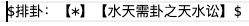

为例方便大家排卦，所有卦例的都按照本人发布的「易学函数库」语法结构书写。用户只要将每个卦例的文字拷贝到 md 文档，并置于两个 $$ 符号之间，就可以得出完整的卦。更详细的安装和使用方法，请移步「[华鹤易学平台文档](https://maiernte.gitee.io/huahedocument/chapter6/libapi.html)」查看。 例如：

> 

#### 卦例

###### 八宫章第三
例1 [64卦：【乾为天】【自占吉凶】](../chapter1/#自占吉凶)

例2 [排卦：【*】【夬之姤】](../chapter1/#夬之姤)

###### 六亲歌章第五
例3 [64卦：【乾为天】](../chapter1/#乾为天)

###### 动变章第七
例4 [排卦：【*】【水天需卦之天水讼】](../chapter1/#天水讼) 

###### 用神元神章九
例5 [排卦：【辰月戊申日】【乾为天之风天小畜】【占父】](../chapter1/用神章.html#占父)

###### 元神忌神衰旺章第十

例6 [排卦：【酉月辛亥日】【泽之解】【求财】](../chapter1/用神章.html#求财)

例7 [排卦：【巳月乙未日】【泽风大过之火风鼎】【自占病】](../chapter1/用神章.html#自占病)

###### 五行相生章第十一

例8 [排卦：【卯月己卯日】【复之震为雷】【兄得重罪】](../chapter1/五行章.html#兄得重罪)

###### 五行相克章第十二

例9 [排卦：【卯月戊寅日】【萃之同人】【占父重罪】](../chapter1/五行章.html#占父重罪)

例10 [排卦：【卯月戊寅日】【否之讼】【占兄官事】](../chapter1/五行章.html#占兄官事)

###### 克处逢生章第十三

例11 [排卦：【辰月丙申日】【既济变革】【占弟癌症】](../chapter1/五行章.html#占弟癌症)

###### 动静生克章第十四

例12 [排卦：【*】【坤为地】【坤卦】](../chapter1/五行章.html#坤卦)

例13 [排卦：【*】【兑之归妹】【兑之归妹】](../chapter1/五行章.html#兑之归妹)

###### 月将章第十六

例14 [排卦：【寅月庚戌日】【火天大有】【占求财】](../chapter1/五行章.html#占求财)

例15 [排卦：【酉月丙寅日】【山风蛊变山水蒙】【占谒贵】](../chapter1/五行章.html#占谒贵)

例16 [排卦：【寅月丙申日】【艮变颐】【占升迁】](../chapter1/五行章.html#占升迁)

例17 [排卦：【午月丁未日】【困变恒】【占弟被讼】](../chapter1/五行章.html#占弟被讼)

例18 [排卦：【寅月丁酉日】【艮变明夷】【占开铺面】](../chapter1/五行章.html#占开铺面)

例19 [排卦：【午月戊辰日】【火地晋】【占妹临产】](../chapter1/五行章.html#占妹临产)

###### 日辰章第十七

例20 [排卦：【申月戊午日】【遁变姤】【占病】](../chapter1/五行章.html#占病)

例21 [排卦：【巳月亥日】【夬变履】【占仆何日回】](../chapter1/五行章.html#占仆何日回)

###### 六神章第十八

例22 [排卦：【申月戊子日】【剥变观】【占生产】](../chapter1/五行章.html#占生产)

例23 [排卦：【申月甲辰日】【屯之震】【占兄病】](../chapter1/五行章.html#占兄病)

###### 六合章第十九

例24 [排卦：【申月丙子日】【明夷之小过】【占出门】](../chapter1/动爻章.html#占出门)

例25 [排卦：【未月丁巳日】【离变旅】【占已悔婚】](../chapter1/动爻章.html#占已悔婚)

例26 [排卦：【卯月甲寅日】【困之节】【占风水】](../chapter1/动爻章.html#占风水)

例27 [排卦：【卯月丁巳日】【离之坤】【两村撕打】](../chapter1/动爻章.html#两村撕打)

###### 六冲章第二十

例28 [排卦：【巳月戊戌日】【风雷益】【占财】](../chapter1/动爻章.html#占财)

例29 [排卦：【午月丙辰日】【恒之豫】【占出外经商】](../chapter1/动爻章.html#占出外经商)

例30 [排卦：【酉月乙未日】【坤为地】【占子久出不归】](../chapter1/动爻章.html#占子久出不归)

例31 [排卦：【巳月甲寅日】【否变乾】【占严师训子】](../chapter1/动爻章.html#占严师训子)

例32 [排卦：【申月己卯日】【巽变坤】【父子七人俱蒙拿问】](../chapter1/动爻章.html#父子七人俱蒙拿问)

###### 三刑章第二十一

例33 [排卦：【寅月庚申日】【家人变离】【占子痘症】](../chapter1/动爻章.html#占子痘症)

###### 暗动章第二十二

例34 [排卦：【寅月已未日】【坤之师】【占女痘】](../chapter1/动爻章.html#占女痘)

###### 动散章第二十三

例35 [排卦：【丑月丁酉日】【涣变坎】【占父出外】](../chapter1/动爻章.html#占父出外)

###### 卦变生克墓绝章第二十四

例36 [排卦：【卯月辛巳日】【巽变乾】【来人不言所事】](../chapter1/卦变墓绝章.html#来人不言所事)

###### 反伏章第二十五

例37 [排卦：【卯月壬申日】【比之井】【占随官府上任】](../chapter1/卦变墓绝章.html#占随官府上任)

例38 [排卦：【卯月己亥日】【临变中孚】【占升迁】](../chapter1/卦变墓绝章.html#占升迁)

例39 [排卦：【申月癸巳日】【姤之恒】【占父外任平安】](../chapter1/卦变墓绝章.html#占父外任平安)

###### 旬空章第二十六

例40 [排卦：【辰月乙卯日】【家人之贲】【占求财】](../chapter1/卦变墓绝章.html#占求财)

例41 [排卦：【辰月乙卯日】【睽之损】【求财再占】](../chapter1/卦变墓绝章.html#求财再占)

例42 [排卦：【子月辛亥日】【大畜】【占远行求财】](../chapter1/卦变墓绝章.html#占远行求财)

例43 [排卦：【子月辛亥日】【明夷之丰】【远行求财再占】](../chapter1/卦变墓绝章.html#远行求财再占)

###### 生旺墓绝章第又二十六

例44 [排卦：【午月己卯日】【震之丰】【占妻病】](../chapter1/卦变墓绝章.html#占妻病)

